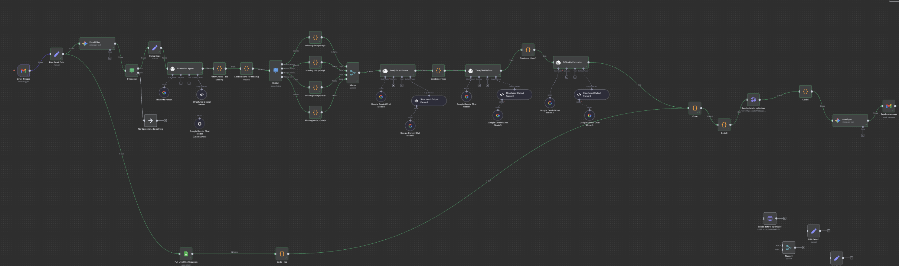

# Architecture Overview

Below is the high-level diagram of the agent components:

## Components

1. **User Interface**  
   - Triggered via n8n (manual run or webhook)  
   - Optionally integrates with email, CLI, or Slack  

2. **Agent Core**  
   - **Planner**: Constructs optimization variables based on user input and hike metadata  
   - **Executor**: Runs FastAPI + Gurobi to compute group-to-hike assignments  
   - **Memory**: Lightweight local cache (JSON logs), optionally linked to a vector store  

3. **Tools / APIs**  
   - Gurobi solver via Python  
   - n8n integrations (Google Sheets, Email, HTTP)  
   - Optional terrain parser for hike features  

4. **Observability**  
   - Logs every assignment to `logs/` folder  
   - Handles malformed inputs and retries failed optimizations  
